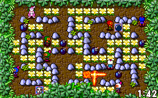
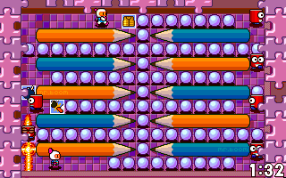

## Mr.Boom port for RetroArch/Libretro.

Mr.Boom is a Bomberman clone for the [RetroArch platform](http://www.retroarch.com) and was converted from DOS assembly using [asm2c](https://github.com/frranck/asm2c).

It runs on all RetroArch platforms: Android, Linux, Mac Os X, Nintendo Gamecube (NGC), Nintendo Wii, Raspberry Pi, Sony Playstation 3 (PS3), Sony Playstation Portable (PSP), Windows, Xbox, Xbox360...

It can also be compiled as a stand-alone version using SDL2.








Mr.Boom supports up to 8 players and features like netplay, AI bots (), pushing bombs, remote controls and kangaroo riding...

Check the [Downloading and Playing Mr. Boom Core](https://youtu.be/_0rw36mA9mM) video.

You can find netplay games by joining the [retroarch discord channel](https://discord.gg/011l9DB6qWt9B4bzO) or #mrboom on freenode!

### Options available:

- Team mode by color or by sex.
- No monster mode.
- Drop bomb button autofire.

### Compiling the Libretro version:

```sh
make clean
make
```

### Compiling the SDL2 version:
- OSX: 
```sh
brew install SDL2 minizip zlib SDL2_mixer --with-libmodplug
make clean
make mrboom LIBSDL2=1
make install
```
- Linux: 
```sh
apt-get install build-essential
apt-get install libsdl2-dev libmodplug-dev libsdl2-mixer-dev libminizip-dev
make clean
make mrboom LIBSDL2=1
make install
```

- Windows: 
```sh
pacman -S mingw-w64-x86_64-toolchain
pacman -S mingw-w64-x86_64-SDL2main
pacman -S mingw-w64-x86_64-SDL2_mixer
pacman -S mingw-w64-x86_64-SDL2
pacman -S mingw-w64-x86_64-libmodplug
make clean
make mrboom LIBSDL2=1 MINGW=mingw64
```

### Libretro packages are available:

- In the optional section from [Retropie](https://retropie.org.uk).
- At the third-party Gentoo overlay [Abendbrot](https://github.com/stefan-gr/abendbrot).

### SDL2 packages are available:

- At the archlinux user repository [AUR](https://aur.archlinux.org/packages/libretro-mrboom-git/).
- Debian [deb](https://packages.debian.org/mrboom).
- [FreeBSD](http://www.freshports.org/games/mrboom).
- mrboom on [repology.org](https://repology.org/metapackage/mrboom/versions).

### Raspberry Pi configuration:

To get a proper speed on Raspberry Pi, make sure you use a 60Hz VGA mode in /boot/config.txt:
```sh
hdmi_group=1
hdmi_mode=4
```

